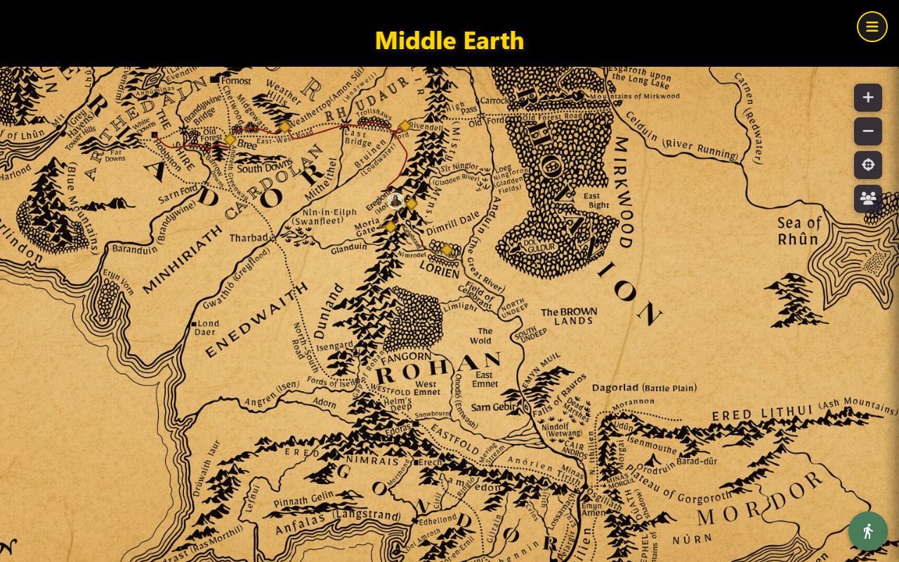
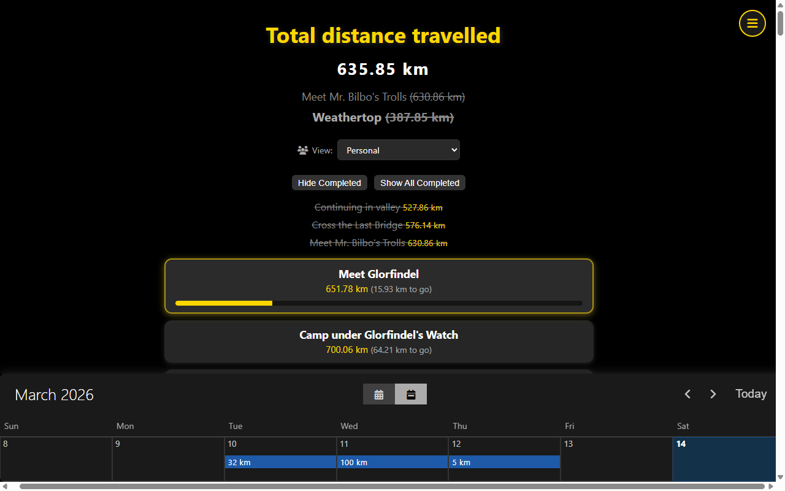
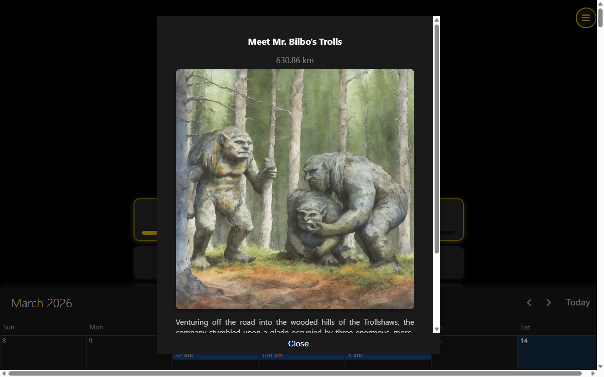
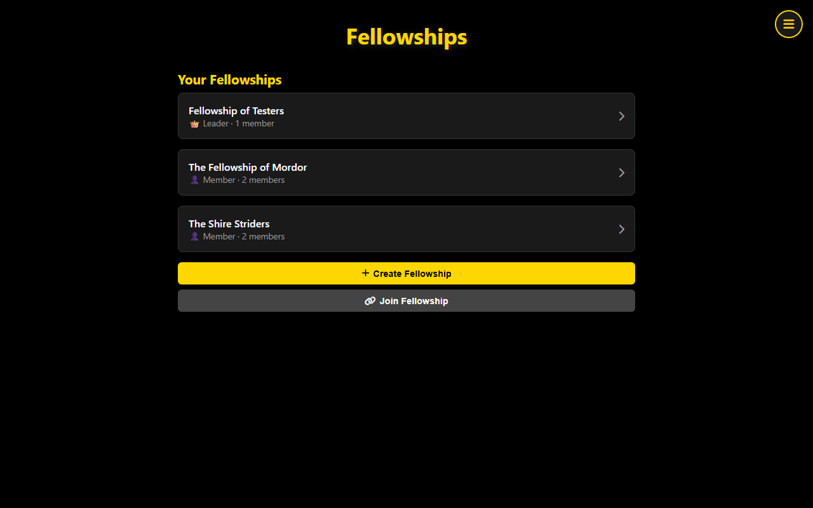
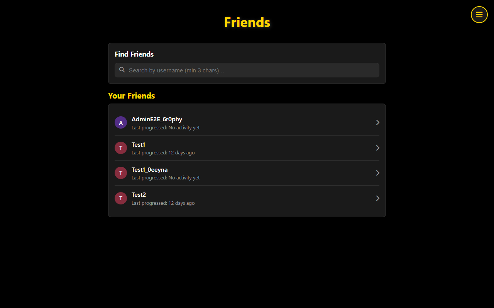

# Walk to Mordor 🧙‍♂️



## Project Description

**Walk to Mordor** is a fitness tracking Progressive Web App (PWA) inspired by J.R.R. Tolkien's *The Lord of the Rings*. This application gamifies your daily walking or running routine by mapping your exercise distances to the epic journey from Bag End to Mount Doom and back again.

Track your real-world exercise progress as you virtually follow in the footsteps of Frodo and Sam on their legendary quest. Every kilometer you walk in real life advances you along the 6,425 km (3,991 mile) round trip from the Shire to Mordor, complete with 191 milestone markers from the books.

## Features

### 🔐 Account & Authentication
- Register with email, verify via confirmation link, log in with session-based auth
- Password reset via email, profile management, LOTR-themed avatar selection (57 avatars)

### 📅 Daily Progress Tracking
- Calendar interface for logging daily walking/running distances (km with decimal precision)
- Edit and delete entries; cumulative distance auto-calculated
- Milestone unlock notifications when you reach story locations

### 🗺️ Interactive Journey Map
- Konva.js-powered tiled map of Middle-earth with 6 zoom levels
- 191 story milestones from Bag End through Rivendell, Moria, Lothlórien, to Mount Doom and back
- User avatar marker at your current position on the journey
- Friend avatar markers showing where your friends are on the map

### ⚔️ Fellowships
- Create and join walking parties (fellowships) with invite codes
- Track combined party progress and individual member contributions
- Activity feed, leadership management, and configurable distance modes
- Invite friends directly to your fellowship

### 👥 Friends
- Add friends via username search or shareable friend codes
- View friend profiles with walking stats and shared fellowships
- Pending request management with badge notifications

### 🛡️ Admin Dashboard
- System statistics, user management (verify, reset password, toggle admin, delete)
- Goal management with image browser (create, edit, search, sort)
- Community metrics: leaderboard with date filters, 30-day activity timeline

### 📱 Progressive Web App
- Offline support via service worker with versioned caching
- Mobile-optimized responsive design
- Install to home screen on any device

## Screenshots

| Journey Dashboard | Goal Detail |
|---|---|
|  |  |

| Fellowships | Friends |
|---|---|
|  |  |

## Technology Stack

- **Runtime**: Cloudflare Workers (serverless edge computing)
- **Database**: Cloudflare D1 (SQLite-based)
- **Frontend**: Islands Architecture — SSR shells + Preact hydration + legacy vanilla JS
- **Map**: Konva.js with tiled zoom, Preact Signals state management
- **Build**: Vite (client), Wrangler (worker)
- **Testing**: Jest (API, 1000+ tests), Vitest (client islands, 490+ tests), Playwright (E2E, 230+ browser tests)
- **Language**: TypeScript (strict mode)

## Getting Started

### Prerequisites
- Node.js 20+
- pnpm (recommended) or npm
- Cloudflare account (for deployment)

### Local Development

```bash
# Install dependencies
npm install

# Start dev server (builds client, seeds local D1, starts Wrangler)
npm run dev
```

The app will be available at `http://localhost:8787/`.

### Running Tests

```bash
npm test                    # Jest API/unit tests
npm run test:client         # Vitest client island tests
npm run test:ui             # Playwright E2E (chromium)
npm run test:ui:all         # Playwright all browsers
npm run test:coverage       # Jest with coverage
npm run test:client:coverage # Vitest with coverage
```

### Production Deployment

```bash
# Create D1 database (first time)
npx wrangler d1 create walk-to-mordor-db
# Update database_id in wrangler.json

# Deploy (runs migrations + builds + deploys)
npm run deploy
```

The `deploy` script automatically:
1. Applies D1 migrations to remote (predeploy hook)
2. Builds client islands via Vite
3. Updates service worker cache version
4. Generates image manifest
5. Deploys Worker to Cloudflare

## Build Commands

| Command | Purpose |
|---|---|
| `npm run build` | Full build: client + SW cache + image manifest |
| `npm run build:client` | Vite build of Preact islands |
| `npm run build:manifest` | Generate image-manifest.json |
| `npm run build:sw` | Stamp service worker cache version |
| `npm run optimize:images` | Optimize goal images + rebuild manifest |
| `npm run tile:map` | Generate map tile pyramid |

## Documentation

Full documentation is in [`docs/`](docs/index.md):

- [Architecture](docs/architecture.md) — System shape, routes, auth model
- [API Reference](docs/api-reference.md) — All HTTP endpoints and contracts
- [Admin API Reference](docs/api-reference-admin.md) — Admin endpoints (goals, users, metrics)
- [Data Models](docs/data-models.md) — D1 schema and relationships
- [Source Tree](docs/source-tree-analysis.md) — Annotated file map
- [UI Overview](docs/ui-overview.md) — SSR shells, islands, legacy JS
- [Frontend Guide](docs/frontend-guide.md) — Building and extending islands
