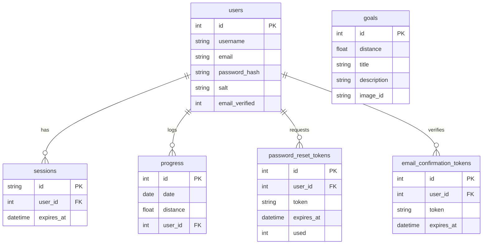

# Data Models (D1 SQLite)

The application uses a relational schema stored in Cloudflare D1.

## Tables

### `users`
Stores user credentials and profile status.
- `id`: INTEGER PRIMARY KEY AUTOINCREMENT
- `username`: TEXT UNIQUE
- `email`: TEXT UNIQUE
- `password_hash`: TEXT
- `salt`: TEXT
- `approved`: INTEGER (0 or 1, for manual approval flows — legacy, superseded by email verification)
- `email_verified`: INTEGER (0 or 1, default 0 — account inactive until verified via confirmation email)
- `created_at`: DATETIME
- `updated_at`: DATETIME

### `sessions`
Manages active user sessions.
- `id`: TEXT PRIMARY KEY (Session Token)
- `user_id`: INTEGER (FK -> users.id)
- `expires_at`: DATETIME
- `created_at`: DATETIME

### `progress`
Stores daily walking logs. A composite unique constraint ensures one entry per user per date.
- `id`: INTEGER PRIMARY KEY AUTOINCREMENT
- `date`: DATE
- `distance`: REAL (in km)
- `user_id`: INTEGER (FK -> users.id)
- `UNIQUE(date, user_id)`

### `goals`
Static milestones for the journey. 171 milestones spanning the Shire-to-Mordor route, plus intermediary goals to ensure no narrative gap exceeds ~70 km.
- `id`: INTEGER PRIMARY KEY AUTOINCREMENT
- `distance`: REAL (Threshold distance in km to reach goal)
- `title`: TEXT (Milestone name/description)
- `description`: TEXT (Rich narrative description of the milestone)
- `special`: TEXT (Optional special event text)
- `image_id`: TEXT (Slug referencing WebP assets in `public/img/highres/` and `public/img/thumbs/`, e.g. `woody-end`)

### `password_reset_tokens`
Temporary tokens for password reset flow.
- `id`: INTEGER PRIMARY KEY AUTOINCREMENT
- `user_id`: INTEGER (FK -> users.id)
- `token`: TEXT UNIQUE
- `expires_at`: DATETIME
- `used`: INTEGER (0 or 1)
- `created_at`: DATETIME

### `email_confirmation_tokens`
Temporary tokens for email verification during registration. Tokens expire after 24 hours. Rate-limited to 3 resend attempts per hour per user.
- `id`: INTEGER PRIMARY KEY AUTOINCREMENT
- `user_id`: INTEGER (FK -> users.id) ON DELETE CASCADE
- `token`: TEXT UNIQUE
- `expires_at`: DATETIME
- `created_at`: DATETIME

**Indexes:**
- `idx_email_confirmation_tokens_user_id` on `user_id`
- `idx_email_confirmation_tokens_token` on `token`
- `idx_email_confirmation_tokens_expires` on `expires_at`

## Entity Relationship Diagram (Mermaid)

