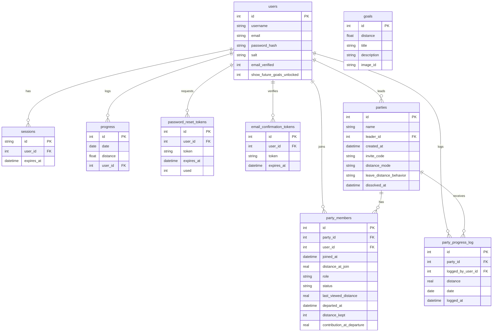

# Data Models (D1 SQLite)

The application uses a relational schema stored in Cloudflare D1.

## Tables

### `users`
Stores user credentials and profile status.
- `id`: INTEGER PRIMARY KEY AUTOINCREMENT
- `username`: TEXT UNIQUE
- `email`: TEXT UNIQUE
- `password_hash`: TEXT
- `salt`: TEXT
- `approved`: INTEGER (0 or 1, for manual approval flows — legacy, superseded by email verification)
- `email_verified`: INTEGER (0 or 1, default 0 — account inactive until verified via confirmation email)
- `show_future_goals_unlocked`: INTEGER (0 or 1, default 1 — controls whether future goals display as unlocked/visible or locked/hidden)
- `default_view_map`: INTEGER (0 or 1, default 0 — user landing preference: journey or map)
- `created_at`: DATETIME
- `updated_at`: DATETIME

### `sessions`
Manages active user sessions.
- `id`: TEXT PRIMARY KEY (Session Token)
- `user_id`: INTEGER (FK -> users.id)
- `expires_at`: DATETIME
- `created_at`: DATETIME

### `progress`
Stores daily walking logs. A composite unique constraint ensures one entry per user per date.
- `id`: INTEGER PRIMARY KEY AUTOINCREMENT
- `date`: DATE
- `distance`: REAL (in km)
- `user_id`: INTEGER (FK -> users.id)
- `UNIQUE(date, user_id)`

### `goals`
Static milestones for the journey. 171 milestones spanning the Shire-to-Mordor route, plus intermediary goals to ensure no narrative gap exceeds ~70 km.
- `id`: INTEGER PRIMARY KEY AUTOINCREMENT
- `distance`: REAL (Threshold distance in km to reach goal)
- `title`: TEXT (Milestone name/description)
- `description`: TEXT (Rich narrative description of the milestone)
- `special`: TEXT (Optional special event text)
- `image_id`: TEXT (Slug referencing WebP assets in `public/img/highres/` and `public/img/thumbs/`, e.g. `woody-end`)

### `password_reset_tokens`
Temporary tokens for password reset flow.
- `id`: INTEGER PRIMARY KEY AUTOINCREMENT
- `user_id`: INTEGER (FK -> users.id)
- `token`: TEXT UNIQUE
- `expires_at`: DATETIME
- `used`: INTEGER (0 or 1)
- `created_at`: DATETIME

### `email_confirmation_tokens`
Temporary tokens for email verification during registration. Tokens expire after 24 hours. Rate-limited to 3 resend attempts per hour per user.
- `id`: INTEGER PRIMARY KEY AUTOINCREMENT
- `user_id`: INTEGER (FK -> users.id) ON DELETE CASCADE
- `token`: TEXT UNIQUE
- `expires_at`: DATETIME
- `created_at`: DATETIME

**Indexes:**
- `idx_email_confirmation_tokens_user_id` on `user_id`
- `idx_email_confirmation_tokens_token` on `token`
- `idx_email_confirmation_tokens_expires` on `expires_at`

### `parties`
Fellowship groups. `distance_mode` and `leave_distance_behavior` govern party-level progress calculation rules.
- `id`: INTEGER PRIMARY KEY AUTOINCREMENT
- `name`: TEXT NOT NULL
- `leader_id`: INTEGER NOT NULL (FK -> users.id, `ON DELETE CASCADE`)
- `created_at`: DATETIME
- `invite_code`: TEXT UNIQUE NOT NULL
- `distance_mode`: TEXT NOT NULL DEFAULT 'incremental' — `'incremental'` (only distance since join counts) or `'cumulative'` (all-time totals summed). Set at creation, immutable.
- `leave_distance_behavior`: TEXT NOT NULL DEFAULT 'keep' — `'keep'` or `'remove'`. Determines whether a departed member's contribution is retained. Leader-updatable.
- `dissolved_at`: DATETIME DEFAULT NULL — set when all members have departed. Dissolved parties cannot be rejoined.

**Indexes:**
- `idx_parties_leader_id` on `leader_id`
- _(implicit via UNIQUE constraint)_ on `invite_code`

### `party_members`
Membership records for each user–party pair. One row per (party_id, user_id). Re-join reactivates the existing row.
- `id`: INTEGER PRIMARY KEY AUTOINCREMENT
- `party_id`: INTEGER (FK -> parties.id, `ON DELETE CASCADE`)
- `user_id`: INTEGER (FK -> users.id, `ON DELETE CASCADE`)
- `joined_at`: DATETIME
- `distance_at_join`: REAL NOT NULL DEFAULT 0 — user's total cumulative distance at the exact moment of joining. Required for `incremental` mode calculation.
- `role`: TEXT NOT NULL DEFAULT 'member' — `'leader'` or `'member'`
- `status`: TEXT NOT NULL DEFAULT 'active' — `'active'`, `'left'` (voluntary departure), or `'kicked'` (leader-initiated)
- `last_viewed_distance`: REAL NOT NULL DEFAULT 0 — party's total distance as of user's last view; used to trigger milestone modals on party switch
- `departed_at`: DATETIME DEFAULT NULL — set when status changes to `'left'` or `'kicked'`; NULL for active members
- `distance_kept`: INTEGER DEFAULT NULL — NULL for active members; `1` (true) or `0` (false) locked at departure to record whether the member's contribution was kept or removed. Captures kick-specific override so progress reads remain correct even if `leave_distance_behavior` changes later.
- `contribution_at_departure`: REAL DEFAULT NULL — computed once at leave/kick time using the party's `distance_mode`; used for fast progress reads of departed members without repeated historical range queries
- `UNIQUE(party_id, user_id)`

> **Invariant:** `role = 'leader'` in `party_members` must always match `parties.leader_id` for the same party. Leader transfers (Story 3.5) must update both columns atomically inside a transaction to prevent inconsistency.

**Indexes:**
- `idx_party_members_user_id` on `user_id` — efficient multi-party membership lookups
- `idx_party_members_status` on `status`
- `idx_party_members_party_id_status` on `(party_id, status)` — composite covering index for active-members-of-party queries (also covers `party_id`-only lookups)

### `party_progress_log`
Audit trail and activity feed for party walks. An entry is created for each active party a user belongs to when they log a walk.
- `id`: INTEGER PRIMARY KEY AUTOINCREMENT
- `party_id`: INTEGER (FK -> parties.id, `ON DELETE CASCADE`)
- `logged_by_user_id`: INTEGER (FK -> users.id, `ON DELETE CASCADE`)
- `distance`: REAL NOT NULL — distance logged in this walk entry (km)
- `date`: DATE NOT NULL — correlates with the `progress` table entry date
- `logged_at`: DATETIME DEFAULT CURRENT_TIMESTAMP — for activity feed ordering and contribution auditing
- `UNIQUE(party_id, logged_by_user_id, date)` — prevents duplicate log entries (mirrors `progress` table's own uniqueness guard)

**Indexes:**
- `idx_party_progress_log_party_id_logged_at` on `(party_id, logged_at)` — composite for activity feed queries
- `idx_party_progress_log_user_id` on `logged_by_user_id`
- `idx_party_progress_log_date` on `date`

## Entity Relationship Diagram (Mermaid)

