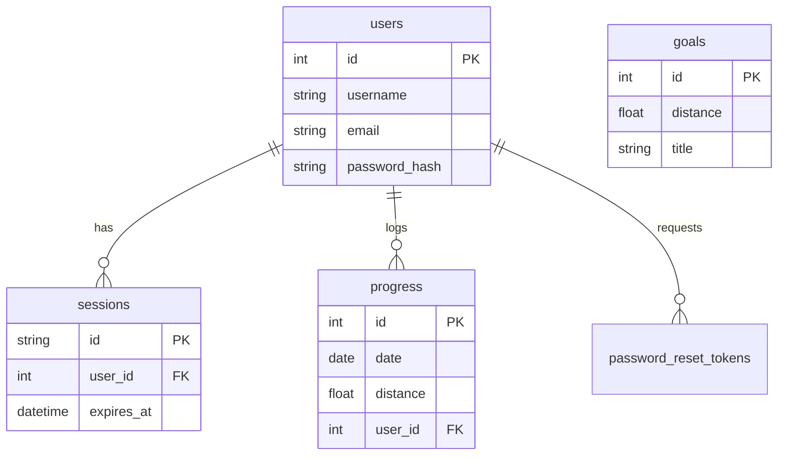

# Data Models (D1 SQLite)

The application uses a relational schema stored in Cloudflare D1.

## Tables

### `users`
Stores user credentials and profile status.
- `id`: INTEGER PRIMARY KEY AUTOINCREMENT
- `username`: TEXT UNIQUE
- `email`: TEXT UNIQUE
- `password_hash`: TEXT
- `salt`: TEXT
- `approved`: INTEGER (0 or 1, for manual approval flows)
- `created_at`: DATETIME
- `updated_at`: DATETIME

### `sessions`
Manages active user sessions.
- `id`: TEXT PRIMARY KEY (Session Token)
- `user_id`: INTEGER (FK -> users.id)
- `expires_at`: DATETIME
- `created_at`: DATETIME

### `progress`
Stores daily walking logs. A composite unique constraint ensures one entry per user per date.
- `id`: INTEGER PRIMARY KEY AUTOINCREMENT
- `date`: DATE
- `distance`: REAL (in km or miles, consistent system-wide)
- `user_id`: INTEGER (FK -> users.id)
- `UNIQUE(date, user_id)`

### `goals`
Static milestones for the journey.
- `id`: INTEGER PRIMARY KEY AUTOINCREMENT
- `distance`: REAL (Threshold distance to reach goal)
- `title`: TEXT (Description)
- `special`: TEXT (Optional special event text)

### `password_reset_tokens`
Temporary tokens for password reset flow.
- `id`: INTEGER PRIMARY KEY AUTOINCREMENT
- `user_id`: INTEGER (FK -> users.id)
- `token`: TEXT UNIQUE
- `expires_at`: DATETIME
- `used`: INTEGER (0 or 1)
- `created_at`: DATETIME

## Entity Relationship Diagram (Mermaid)

