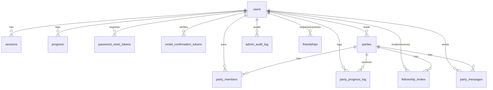

# Data Models (D1 SQLite)

> Last updated: 2026-03-17 · Migrations: 0001–0124 · Full DDL: `migrations/`

## Tables

| Table | Purpose | Key Migration |
|---|---|---|
| `users` | Credentials, profile flags, avatar, friend code | 0006, 0008 |
| `sessions` | Active user sessions (token-based) | 0008 |
| `progress` | Daily walking logs (one entry per user per date) | 0002 |
| `goals` | Milestones on the Shire-to-Mordor route (managed via admin UI) | 0003 |
| `password_reset_tokens` | Temporary tokens for password reset flow | 0010 |
| `email_confirmation_tokens` | Email verification tokens (24h expiry, 3 resends/hr) | 0008 |
| `parties` | Fellowship groups with configurable distance modes | 0020+ |
| `party_members` | User–party membership with join/departure tracking | 0020+ |
| `party_progress_log` | Audit trail / activity feed for party walks | 0020+ |
| `admin_audit_log` | Append-only admin action log (never deleted) | 0020+ |
| `friendships` | Mutual friend relationships (pending → accepted) | 0020+ |
| `fellowship_invites` | Friend-based party invitations | 0020+ |
| `party_messages` | Fellowship chat messages for unified activity feed | 0124 |

## Key Constraints & Invariants

These are rules the schema enforces or that the application layer must uphold — not discoverable from DDL alone.

### users
- `is_admin` toggled via admin UI (`POST /api/admin/users/:id/toggle-admin`). Admins cannot revoke their own admin status.
- `avatar_id` must be NULL or a valid slug from `src/avatar-slugs.ts` (validated by `isValidAvatarSlug` on PUT).
- `friend_code`: 8-char cryptographically random; backfill logic in `src/auth-utils.ts`.

### parties
- `distance_mode` (`incremental` | `cumulative`): set at creation, **immutable**.
- `leave_distance_behavior` (`keep` | `remove`): leader-updatable.
- `dissolved_at` set when all members depart — dissolved parties cannot be rejoined.

### party_members
- **Leader invariant:** `role = 'leader'` must match `parties.leader_id`. Leader transfers must update both atomically in a transaction.
- `distance_at_join` captures cumulative distance at join — required for `incremental` mode calculation.
- `distance_kept` and `contribution_at_departure` are frozen at departure to preserve correct progress reads even if `leave_distance_behavior` changes later.
- Re-join reactivates the existing row (no new insert).

### friendships
- `UNIQUE(requester_id, addressee_id)` only prevents one-direction duplicates. **Application layer must check both directions** before inserting (enforced in friend request handler).
- `CHECK(requester_id != addressee_id)` — no self-friending.

### fellowship_invites
- Partial unique index `(party_id, invitee_id) WHERE status = 'pending'` prevents duplicate pending invites while allowing re-invites after rejection.
- `inviter_id` must be an active party member; `invitee_id` must be an accepted friend — enforced at application layer.
- Pending invites invalidated (set to `'rejected'`) on party dissolution.

## Foreign Key Cascade Decisions

| FK | Behavior | Rationale |
|---|---|---|
| `party_*` tables → `parties.id` | CASCADE | Deleting a party removes all related data |
| `parties.leader_id` → `users.id` | CASCADE | Leader deletion cascades to party |
| `email_confirmation_tokens.user_id` | CASCADE | Cleanup on user deletion |
| `admin_audit_log.admin_user_id` | **No cascade** | Audit records must survive user deletion |
| All other user FKs | CASCADE | Standard cleanup |

## Migration Conventions

- Path: `migrations/NNNN_descriptive_name.sql` (zero-padded 4-digit sequence).
- Each migration is a single DDL or data-manipulation operation.
- Schema changes go in migrations; application logic stays in TypeScript.
- Goal description updates use dedicated migrations (see `0011`–`0019` series).
- Deploy: `npx wrangler d1 migrations apply walk-to-mordor-db`.

## Entity Relationship Diagram

